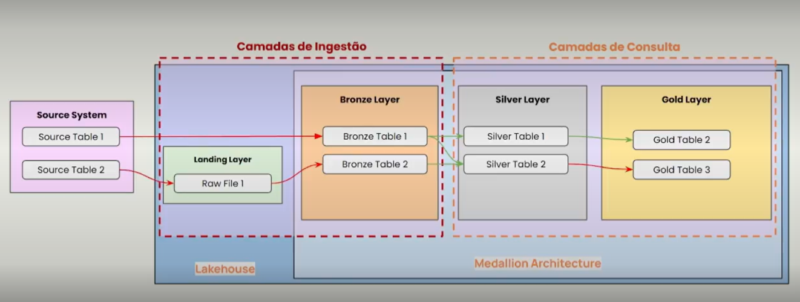

# engenharia-dados-pipeline
Projeto de aplicação pratica de conhecimentos adiquiridos curso de Pós Graduação e Engenharia de Dados disciplina Engenharia de Dados na Pratica 

# Descrição detalhada 
Este projeto simulara a contrução de um pipeline de dados usando a Arquitetura de Dados Medalion, que é divida em três camadas detro do DataLake conforme a figura abaixo:

